# Before You Begin
[[toc]]


Before you discover a System in Sunshower.io, you will need to create an account with your 
cloud service provider with the appropriate permissions. 
Below is a set of guides for all the supported clouds.


## Amazon Web Services Identity Access Management (IAM)

If you're using Amazon Web Services, you will need to create an IAM Role before you can discover and optimize your System.
This guide assumes a basic familiarity with AWS IAM roles and the AWS Console.  If you're not familiar with the AWS Console
or AWS IAM, please contact us and we can help you get started.


### Step 1:  Log into AWS

Navigate to [https://aws.amazon.com](https://aws.amazon.com) and select the large Orange button to the top right.  

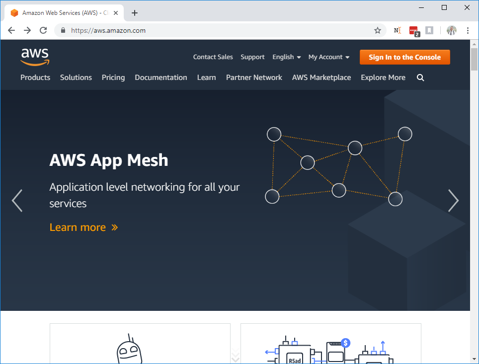


This should
take you to the AWS signin portal.  Use your AWS credentials to sign into the console:

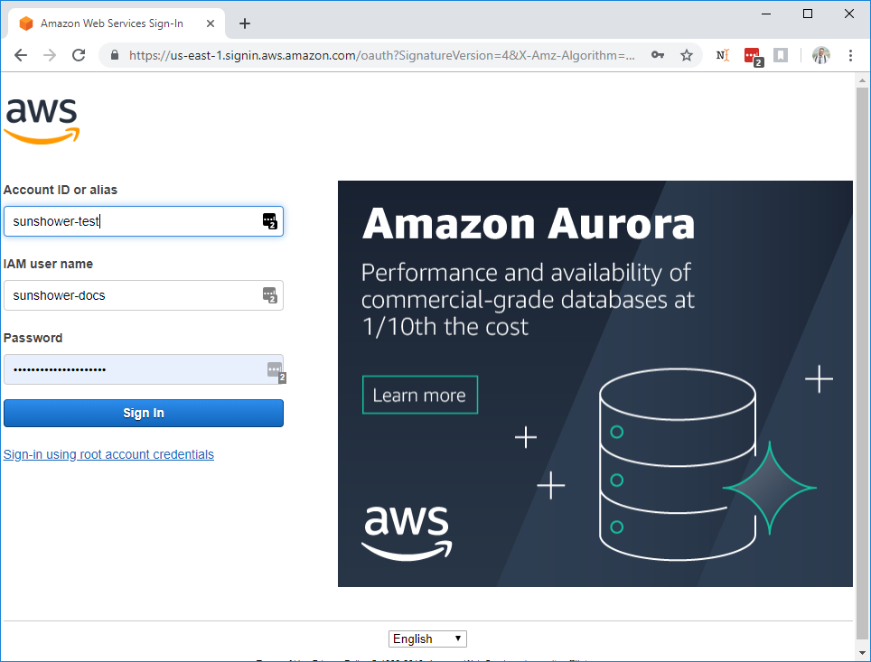

### Step 2: Locate IAM Management Console

You'll be redirected to the AWS Management Console.  In the `Find Services` field, search for "IAM":

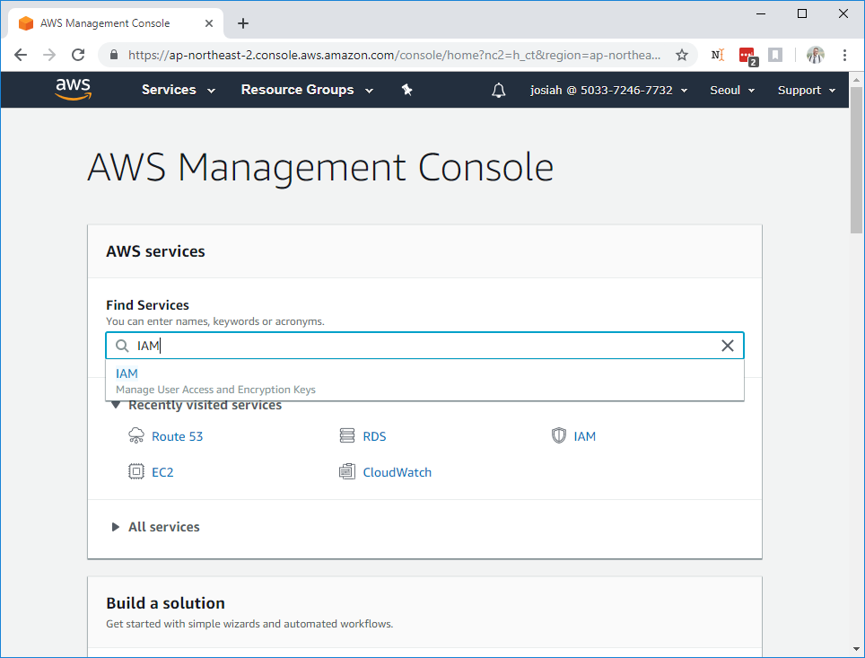

Select the entry from the dropdown; you'll be taken to the IAM Dashboard:


### Step 3: Create IAM Role 

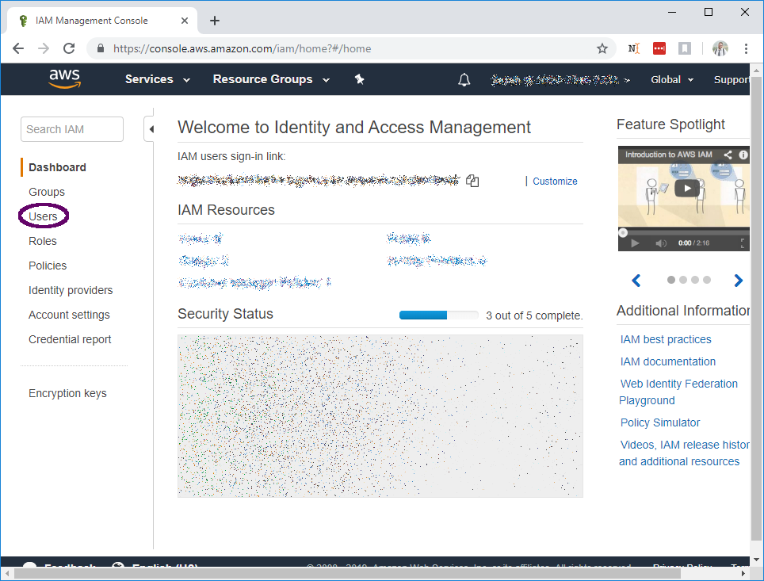

In the left-hand menu, select `Users`.  You'll be taken to the user management page

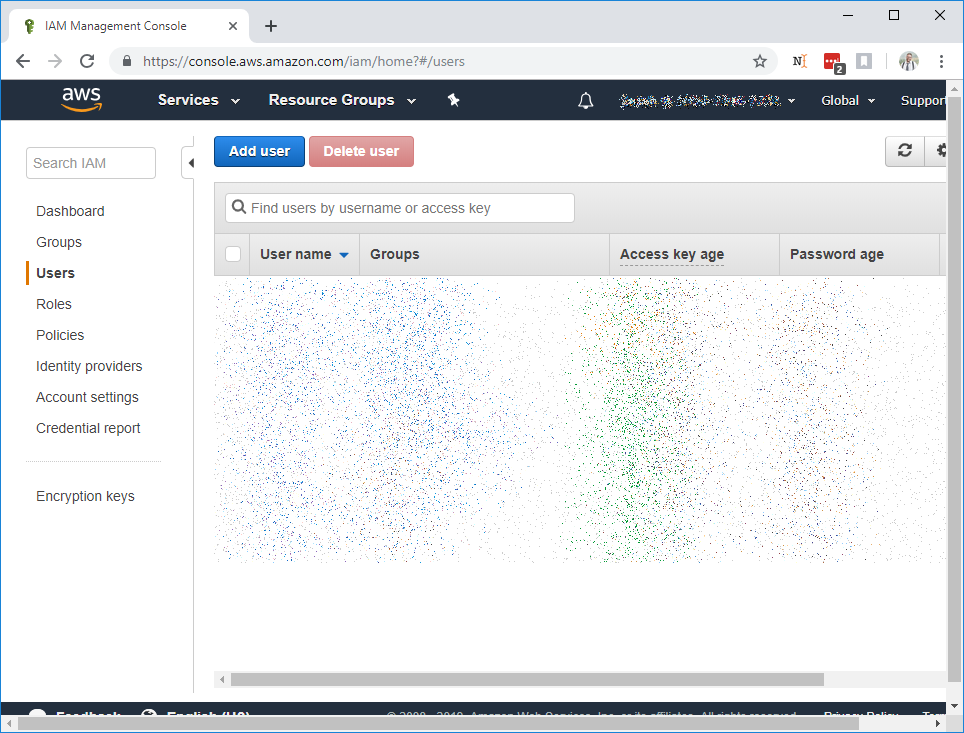

Select `Add User` to create a new user.  The user details page will prompt you for a username, it's best to make it
descriptive and related to sunshower (e.g. sunshower-io-readonly).  Select the `Access Type: Programmatic Access` checkbox and
proceed by clicking `Next: Permissions`

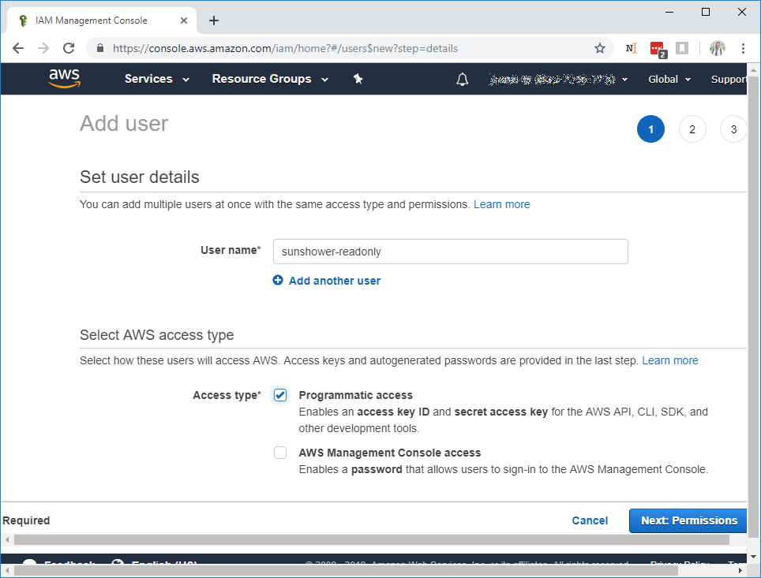

This will bring you to the `Permissions Page`:


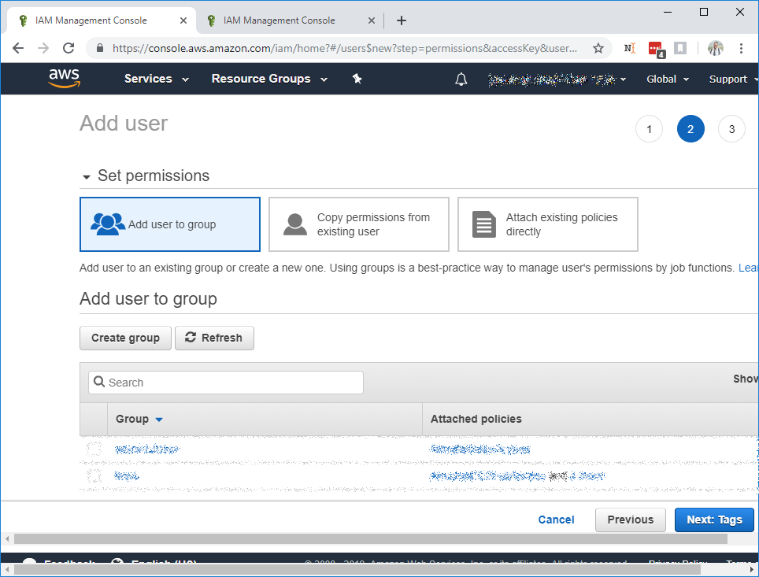


Before you select `Create Group`, read over the options below for your Sunshower.io IAM Role: 


Sunshower.io can be run in

1. Read-Only mode or
1. Management mode


depending on what you want to use it for.  

#### Read-Only Mode 

Read-only mode grants Sunshower.io only enough access to run its optimizations.  Certain features (discussed below) will
not be available.  Unless you specifically want one of Sunshower.io's management features, such as lifecycle scheduling, 
we recommend running it in Read-Only mode. 


##### Create a Read-Only IAM Credential


Select `Create Group`.  This will open the `Group Creation` dialog that we will use to assign Sunshower.io read-only 
permissions.


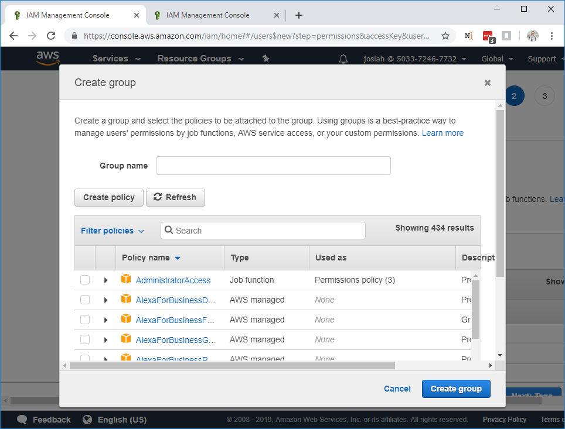

Before entering your group name, select `Create Policy`, which will open a new browser tab to the policy definition page. 
Select the `JSON` tab and paste the following JSON document into the text-area:

```$json
read-only-policy.json 

{
  "Version": "2012-10-17",
  "Statement": [
    {
      "Action": [
        "autoscaling:Describe*",
        "ec2:Describe*",
        "cloudwatch:Describe*",
        "cloudwatch:Get*",
        "cloudwatch:List*"
      ],
      "Effect": "Allow",
      "Resource": "*"
    }
  ]
}

```


Enter the policy name and description.  You should see something like:

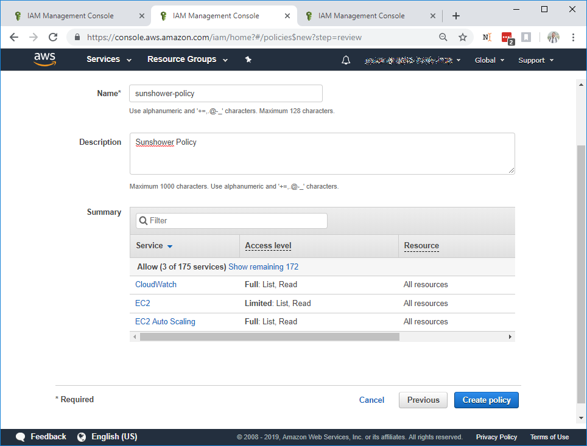

Click `Create Policy`.  You'll be redirected to a list of policies.  In your browser, return to the `Create Group` tab.
Click `Refresh` to load the policy that you just created.  Enter the policy name in the `Search` box to find the
Sunshower.io policy:


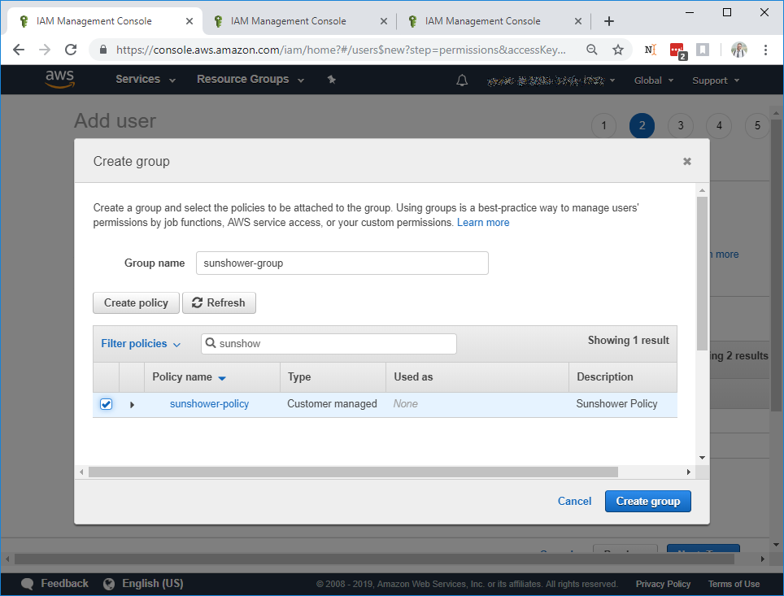

Select the policy and enter the group name, then click `Create Group`.  This will return you to the `Add user to group` page with
the correct group selected.  

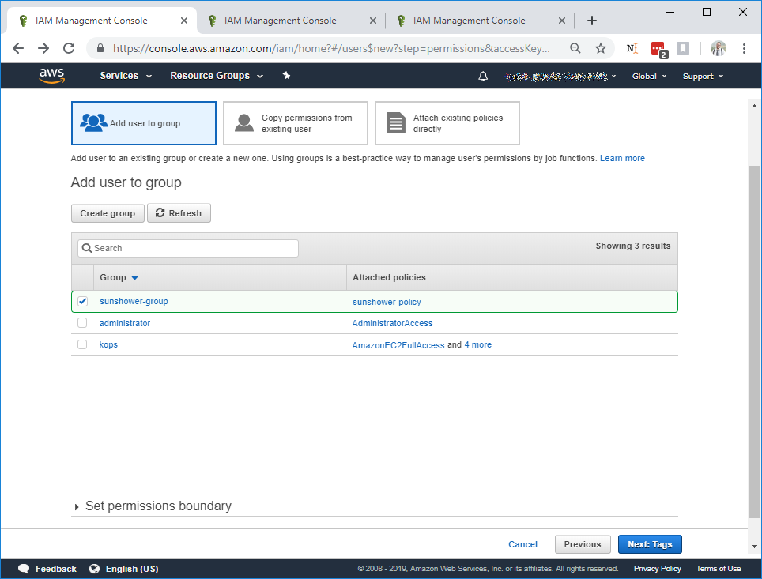

Click `Next: Tags`

You shouldn't need to add anything here.  Click `Next: Review`.  You'll be presented with a summary:

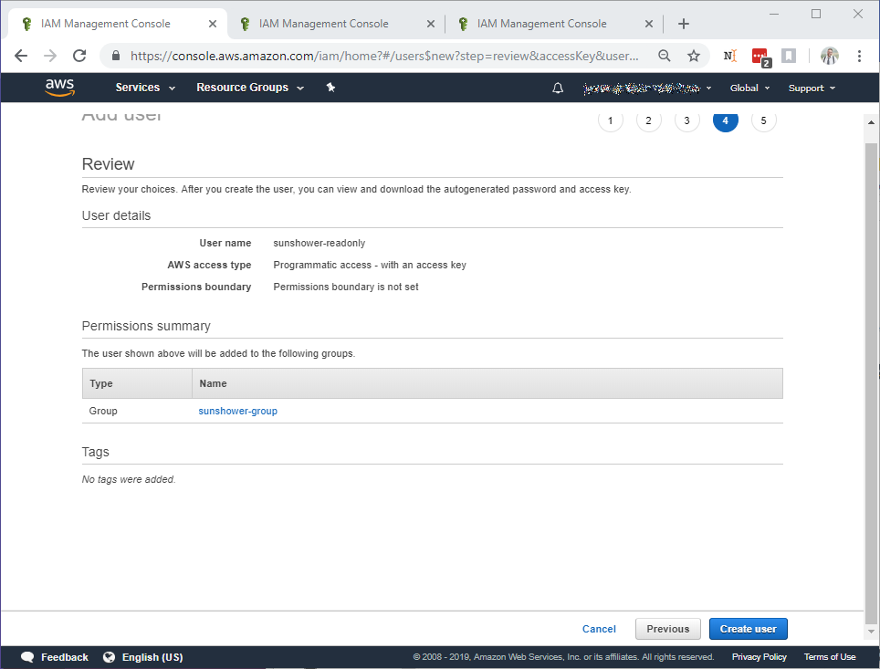


Select `Create: User`.  This will present you with your new IAM Credential.  

*_IMPORTANT_*
```
Do not close this window yet.  You will have to repeat part of the process
```
We're not fully bluring ours out so you can see what they look like, but the ones presented here are not active:

Under the `Secret access key` column, click `Show` to reveal your Secret access key.  
The `Access key ID` and `Secret access key` need to be saved securely as they're required for `System Discovery`


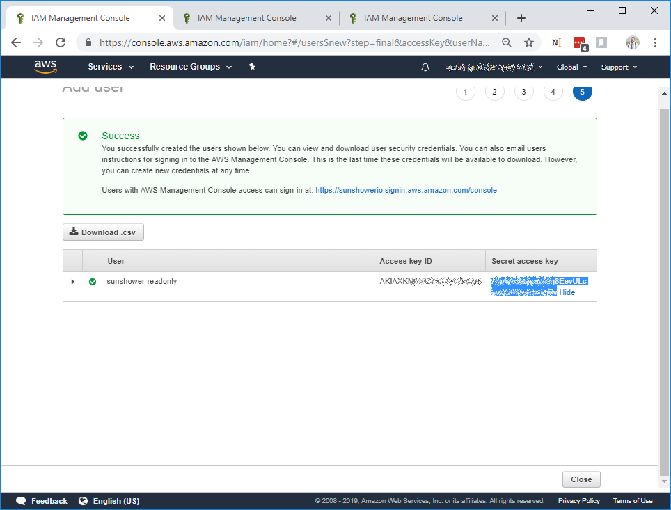


Congrats! That was the hard part!  Continue to Discovery to create your system


#### Management Mode

If you're using Sunshower.io to modify your infrastructure or run infrastructure schedules, 
you should opt for `Management mode`, keeping in mind that it does allow us more access
to your infrastructure.  AWS IAM is very granular, so depending on how much access you give us we may or may not
be able to perform an operation.

The process is exactly the same as in Read-Only Mode (Above), except that when you're creating your IAM Policy Document
you should use:


```$json


``` 


 


 