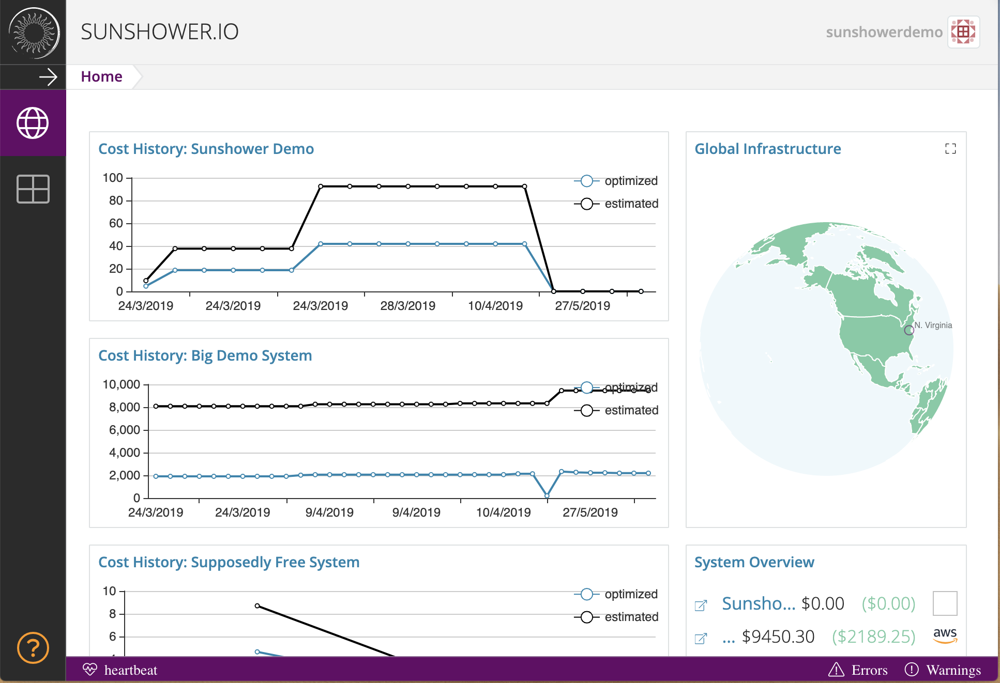
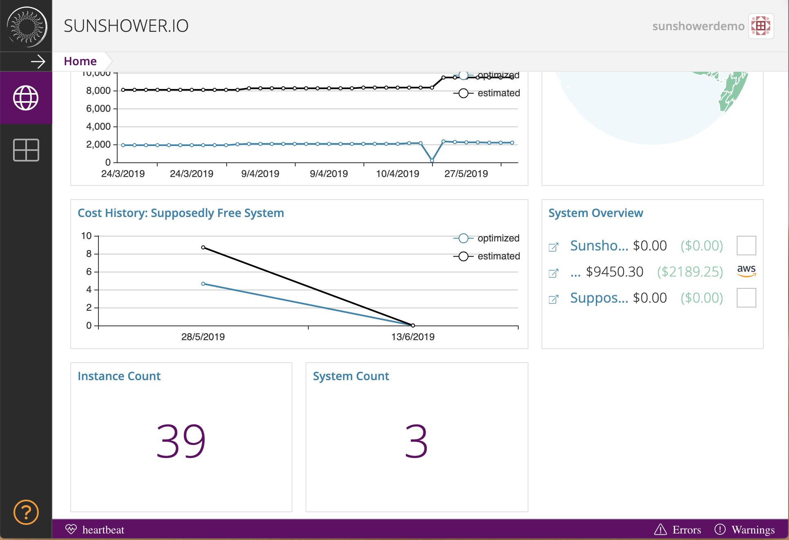

# Dashboard
The dashboard gives you an at-a-glance summary of your systems and instances:

<<<<<<< HEAD
##Cost History
This graph tracks your spending on EC2 instances, showing both estimated and optimized costs over time.

##Global Infrastructure

The globe feature shows you the regions in which you have live instances. Not only is it fun to see all the places in which you 
have instances, but it can also help you keep track of instances you might have forgotten about. And yes, it spins

## System Overview
This card keeps track of your current bill for the systems you have discovered
within the Sunshower platform. On this card, you will see the name of your system, 
your current bill in black, and in green, you will see your potential bill if 
you optimize your instance use. Click the name of the system to navigate directly to that system's context.

<<<<<<< HEAD
##System count and instance count
The System Count card reflects the number of systems you have created within the Sunshower platform. The 
Instance Count shows how many instances were present on those systems the last time those system were refreshed. If you 
have launched additional instances and/or terminated existing instances, you will need
to click the refresh button from within the context of a system.

