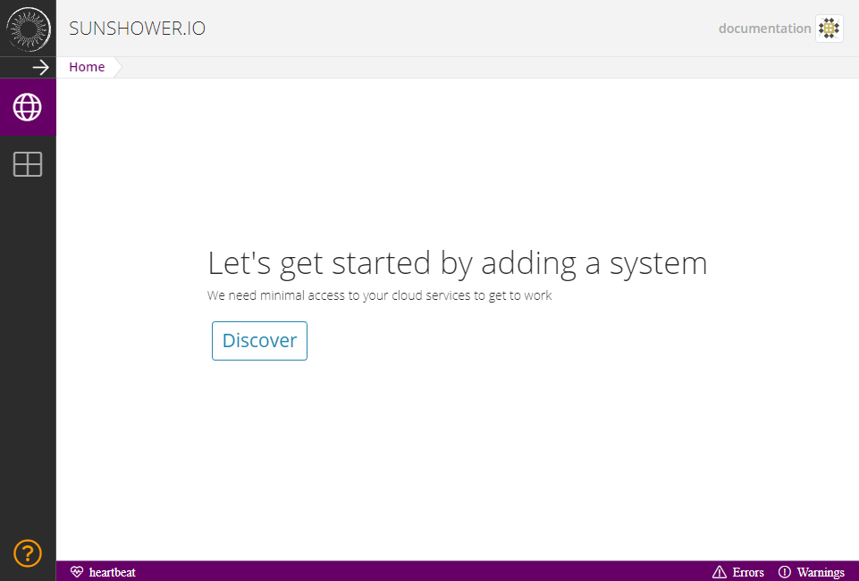
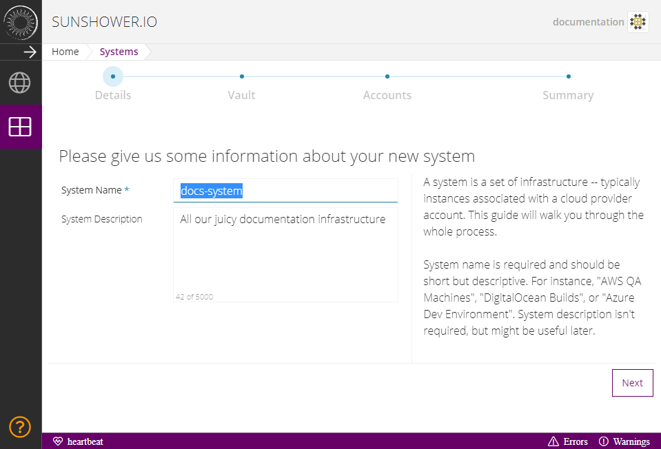
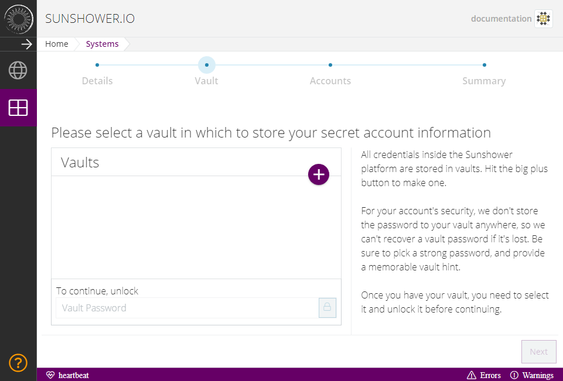
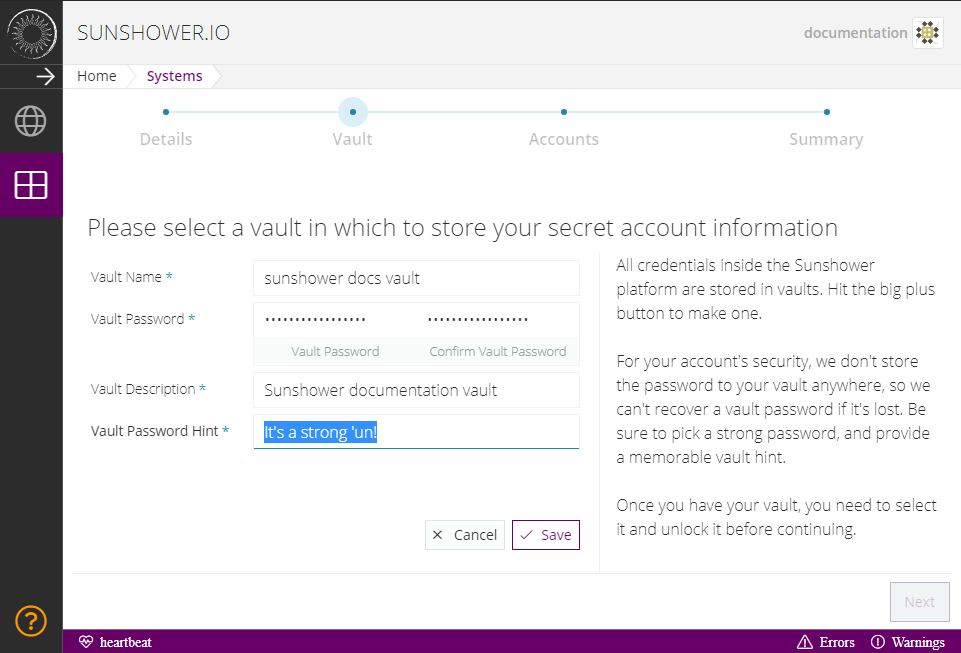
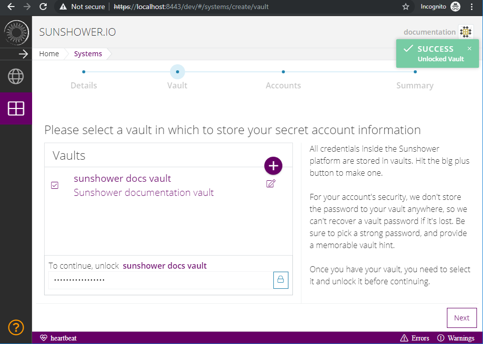
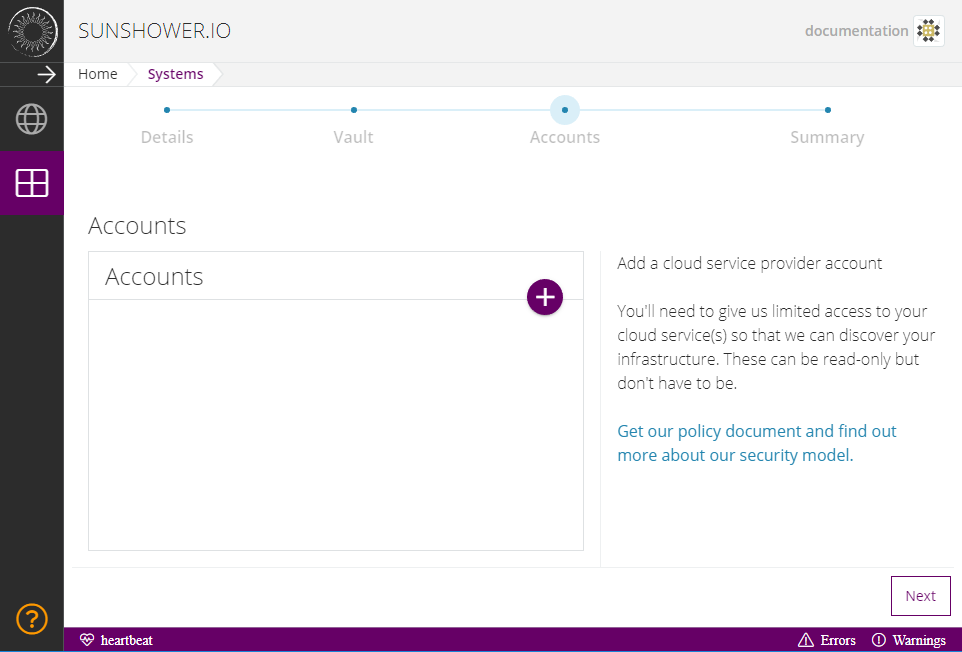
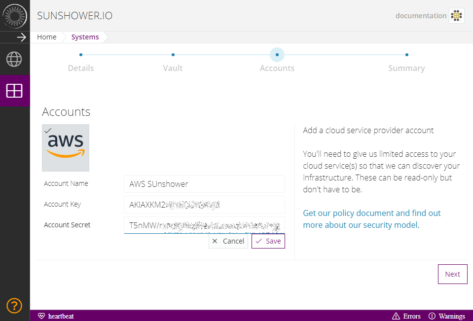
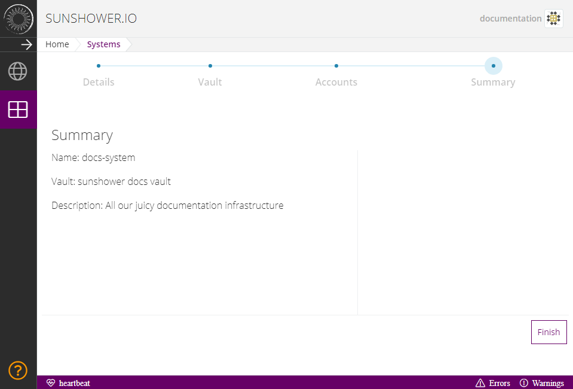
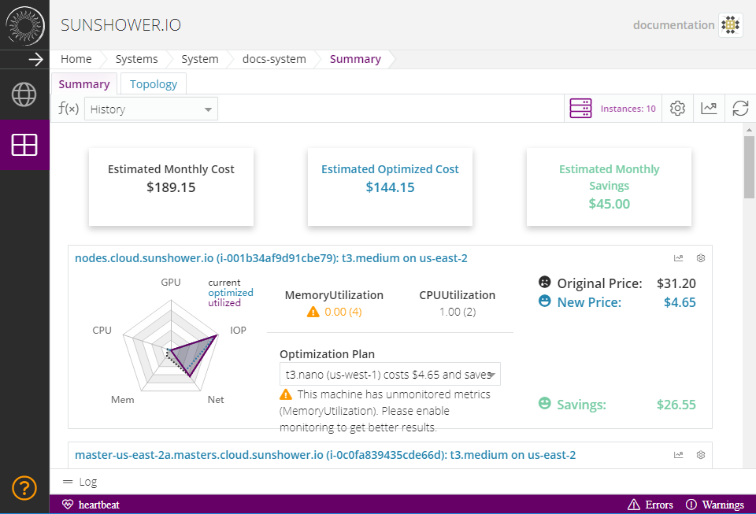

# Discovery


After you create an account, the first thing you'll want to do is discover a system.  The first page that will be presented
to you is a call-to-action to discover if you have not previously discovered a system.



## System Details

Click the _Discover_ button.  You'll be guided to the system discovery wizard.  The first page allows you to enter some
details about your system such as its name, as well as providing a place where you can enter notes about the system, 
its purpose, etc.




## Vaults

The next page you'll encounter after System Details is the vault page.  Sunshower.io stores your cloud credentials (e.g. IAM roles)
in a strongly-encrypted format that we can't access.  When you create a vault, any data placed in it is locked up and we
don't keep a key.  When you want to use Sunshower.io to take a given secret and do something with it, such as use it to discover
your infrastructure, you have to supply your key. 

In other words, even if Sunshower.io is compromised, you cloud secrets will be safe and no one will be able to access them
without your vault password.  Not even us.

So, let's create one.  If you're still on the System Details page, click "Next" to continue to the vault selection page:




Initially, you won't have any vaults, so the list of vaults will be empty.  To create one, click the purple FAB on the
top-right hand corner of the vault list.  The list will flip around and you can enter the vault details.

#### Important!

```
The password you use to secure your Vault is unknown and unrecoverable to Sunshower.io. 
You must store it elsewhere: we strongly recommend LastPass for this.  This is an important
part of Sunshower.io's security model; we hope to find a more convenient, equally-secure way 
to store your information soon.
```



Select Save.  The vault will be created and the form will flip back around and you'll be presented with it in the list.
Click on the newly-created vault to select it, then enter its password in the field beneath the list to unlock it:




## Accounts

Once you've unlocked the vault, click "Next" on the Wizard.  You'll be directed to the `Accounts` page where you'll add
in your Cloud Provider Credentials.



As with the Vault, click the purple `+` button to the top-right, this will flip the accounts list so that you can 
add a new account.



Any descriptive name for the `Account Name` will work.  For the `Account Key` set it to the `Access key ID` that 
you created in [Creating an IAM Account](/pages/en/guide/before-you-begin.html#amazon-web-services-identity-access-management-iam)
and the `Account Secret` will be the `Secret access key`.


Once you've entered your IAM Role, click the `Save` button.  You'll be returned to the Accounts list.  Click `Next` to be
presented with the Discovery Summary:




## Discovery

Click `Finish` to begin the Discovery process.  You'll briefly be taken to a loading page while we go in and discover your
infrastructure, then you'll be presented with your infrastructure summary:




Congratulations!  You've successfully created a System and discovered it.  In subsequent chapters we'll explore some 
advanced techniques for aggressively optimizing your infrastructure.
