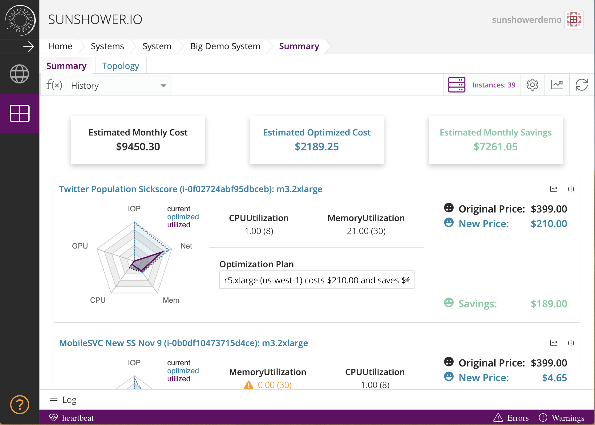
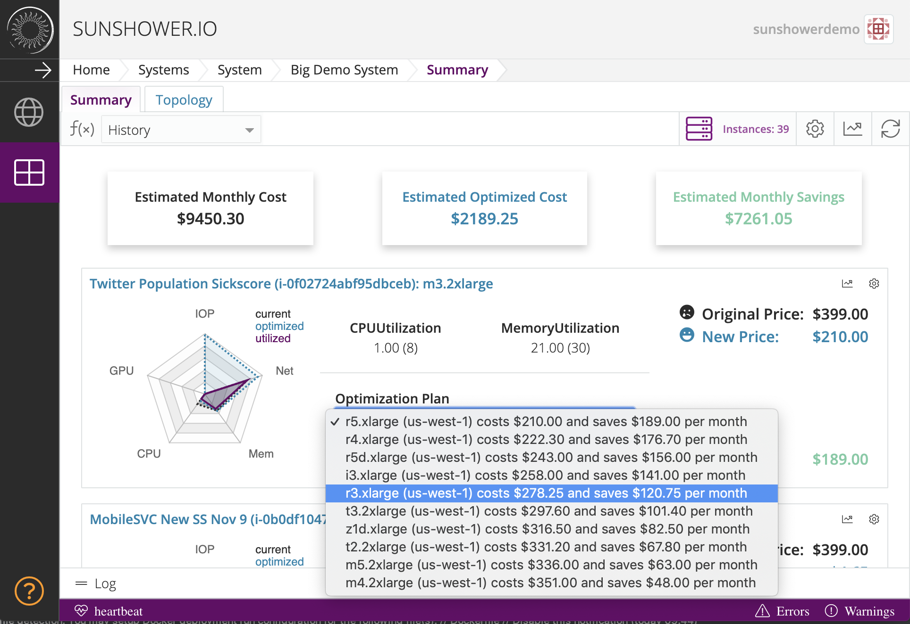
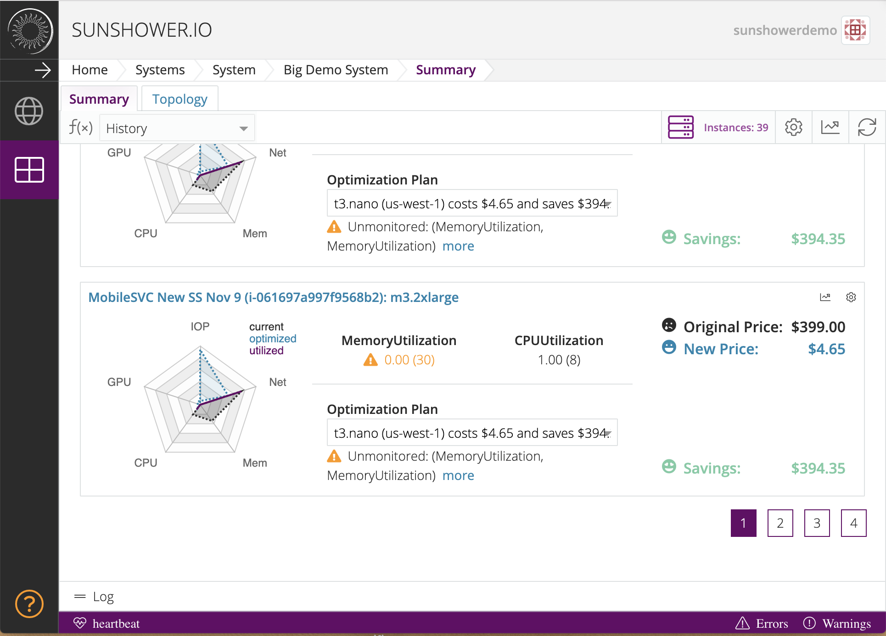
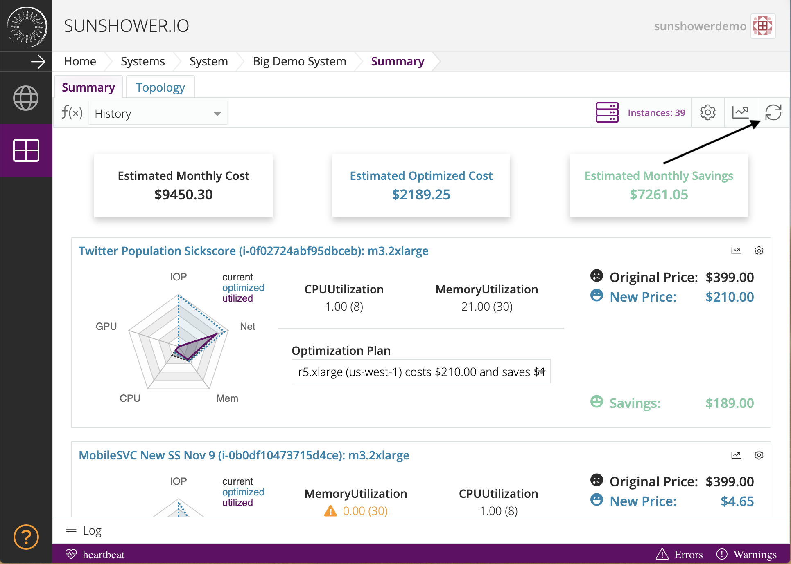

#Summary page

##About optimization
Each instance card shows whether savings on that instance have been optimized. It will show 
where the instance was launched, what you will save if you switch regions, and which regions
will save you money. 

##Memory Utilization and CPU Utilization
These two features show how much CPU and Memory the machine has allocated versus how much you are using
based on cloudwatch data sampled and smoothed over the course of a month.

##Radar chart
The radar chart illustrates resource utilization for the main dimensions. It shows not only what
you have but what you are using and what you could possibly use. 

##Optimization plan
The optimization plan is a drop-down menu that shows your options for launching instances. You
will see not only the regions but also how much you will owe or save if you choose to 
launch instances out of that region.

##Pagination
The summary page only shows twelve instances at a time. Underneath the twelfth instance, you will be able to navigate between your pages of instances.

##Refresh button
If you have launched or terminated instances, you will need to update your information on the Sunshower platform by refreshing 
your information on either the topology page or summary page. To do this, hit the platform's refresh button.

