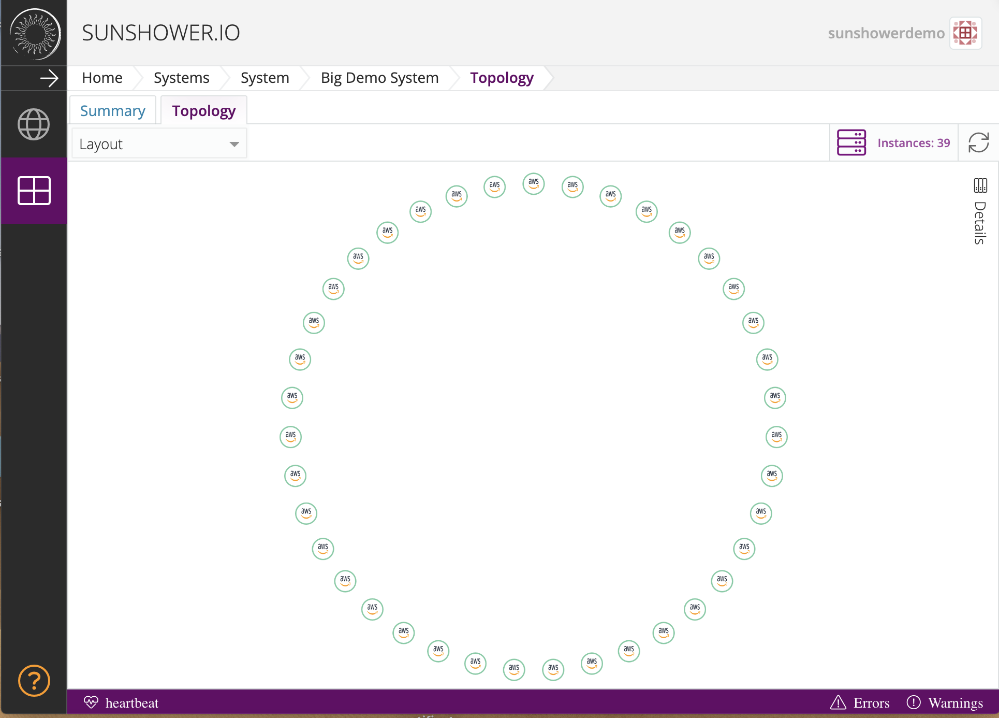
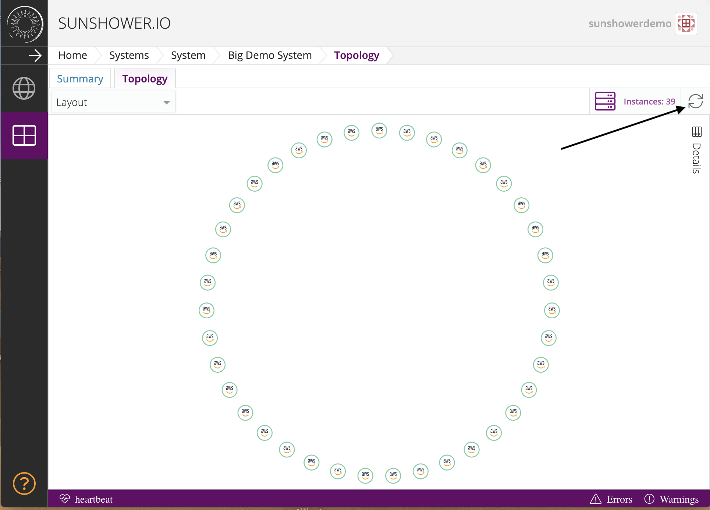

#Topology

Topology is a visual representation of your instances: launched, pending, and terminated.
Pending instances will be shown in yellow. Live instances are green, and terminated instances
will be red. 

##Refresh Button

If you have either launched or terminated instances, you will need to hit the refresh button 
in the upper right-hand corner. This will make the topology page show the changes to your instances. 

